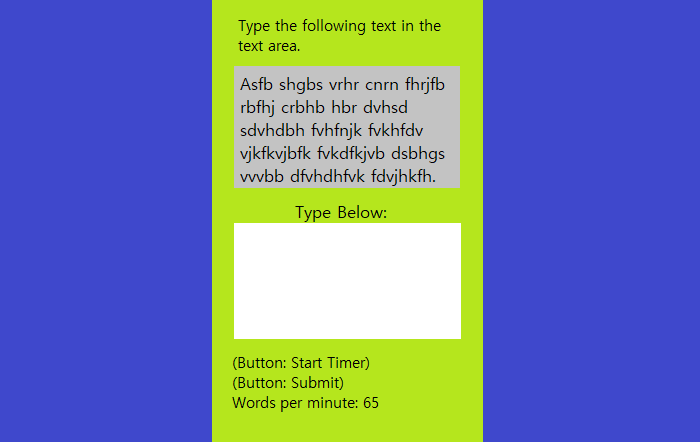
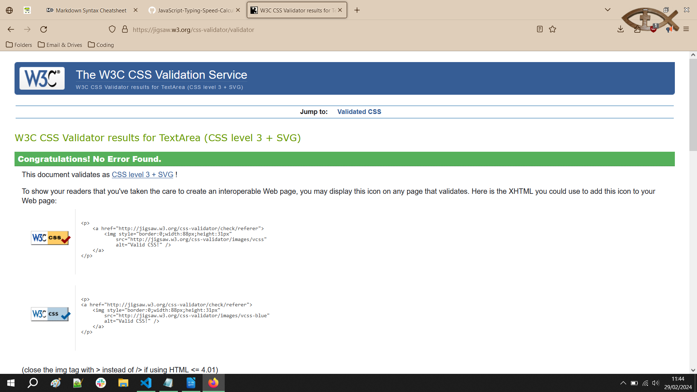
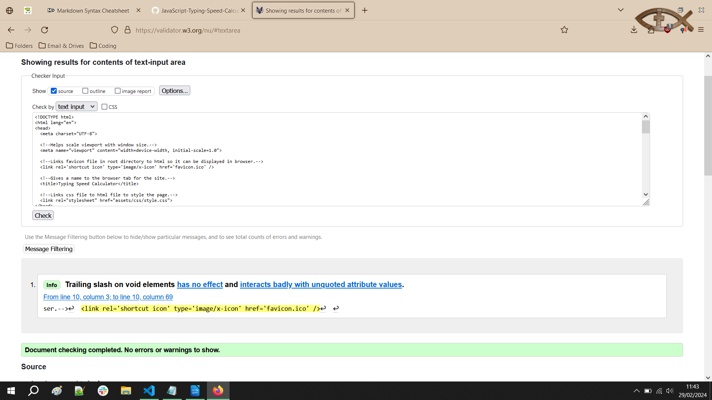
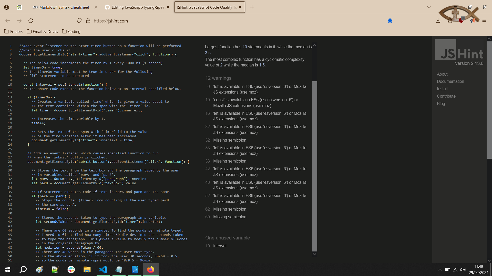

# Typing Speed Calculator
[You can view the live project by clicking this link.](https://benjamin-walsh.github.io/JavaScript-Typing-Speed-Calculator/)

This website is designed to help you find out how fast you can type. The typing speed is measured
in words per minute, which is a common unit of measurement for typing. The site is 
designed to be intuitive and easy to use. 

## User Experience (UX)
### 1. User Stories
1. First-Time Visitor Goals
   
   a. Visiting the site for the first time, someone should understand the purpose
      of the site within seconds of viewing the page.
   
   b. The first-time visitor should be able to use the site without struggling
      with a confusing UI or instructions, and acheive what they came for quickly. 

3. Returning Visitor Goals
   a. As a returing visitor, someone would likely wish to improve their personal
      best 'words per minute' score.

### 2. Design
1. Images  
   The image on the site helps to convey the purpose of the site to the viewer in an efficient way.
   The image depicts a woman typing at a laptop.
   
3. Colour Choice  
   The page's background is dark blue, which contrasts strongly with the light green of the main
   content section. This helps draw the user's focus to the page's content.
   
5. Typography  
   Arial is the main font on the page. Verdana & Helvetica are backup fonts in case
   another should fail to load for some reason. These fonts are bold, slick and easily
   legible, which suits the site as users should be able to read what they are typing easily.          

### Wireframe 

## Features
1. Start timer button to begin counter counting in seconds while the user types.  
2. Submit button which checks if what the user typed matches the paragraph of text,  
   giving an error message if not and telling the user how many words per minute they  
   typed if they do match.  
3. Reset page button which clears text area and resets variables.  

## Utilized Technologies
### Languages:
JavaScript  
HTML5  
CSS3  

### Other Programs:  
Visual Studio Code (for coding)  
GitHub (for storing code and page deployment)  
MsPaint (for basic wireframe)  
Freeconvert.com (to convert images to webp format)  
PythonTutor.com (for checking JavaScript code)  
Jshint.com (Javascript validator)  
W3C Jigsaw (CSS validator)  
W3C Markup (HTML Validator)  

## Testing
The W3C Markup, W3C Jigsaw and JShint validators were used to test the css, html and javascript in this project.
There were missing semicolons in the JS file which were subsequesntly added. The CSS file and html file had no errors.

## Credits 

### Media
Image by StartupStockPhotos from https://pixabay.com//?utm_source=link-attribution&utm_medium=referral&utm_campaign=image&utm_content=849825

### Resources
How to Get HTML Boilerplate in VS Code: [Link to bodhtutorials article](https://www.bodhtutorials.com/how-to-get-html-boilerplate-in-vs-code/)
Converted image from jpg to webp with https://www.freeconvert.com/jpg-to-webp
Font information (https://www.geeksforgeeks.org/what-are-web-safe-fonts-and-fallback-fonts-in-css/)
Project based on help from Code Institute course
Code Institute project template used: https://github.com/Code-Institute-Org/ci-full-template
Rounding Floats credit: https://www.w3schools.blog/tofixed-number-javascript-js
Used for device mockups: https://app.shotsnapp.com/
     
