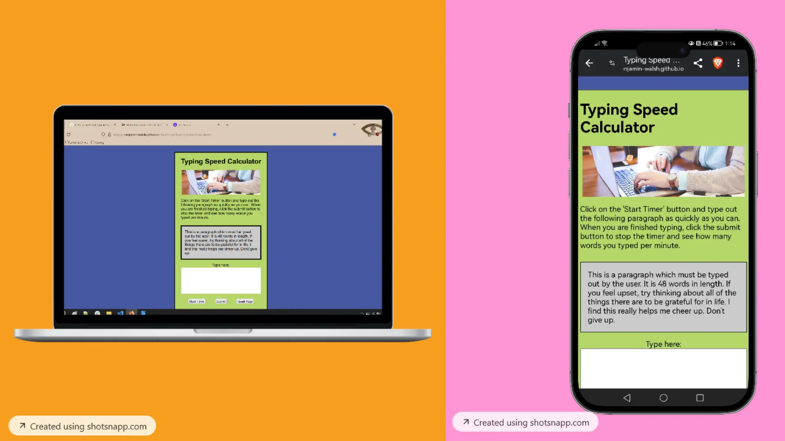

# Typing Speed Calculator
[You can view the live project by clicking this link.](https://benjamin-walsh.github.io/JavaScript-Typing-Speed-Calculator/)

This website is designed to help you find out how fast you can type. The typing speed is measured
in words per minute, which is a common unit of measurement for typing. The site is 
designed to be intuitive and easy to use. 

## User Experience (UX)
### 1. User Stories
1. First-Time Visitor Goals
   a. Visiting the site for the first time, someone should understand the purpose
      of the site within seconds of viewing the page.
   b. The first-time visitor should be able to use the site without struggling
      with a confusing UI or instructions, and acheive what they came for quickly. 

2. Returning Visitor Goals
   a. As a returing visitor, someone would likely wish to improve their personal
      best 'words per minute' score.

### 2. Design
1. Images
   The image on the site helps to convey the purpose of the site to the viewer in an efficient way.
   The image depicts a woman typing at a laptop.
2. Colour Choice
   The page's background is dark blue, which contrasts strongly with the light green of the main
   content section. This helps draw the user's focus to the page's content.
3. Typography
   Arial is the main font on the page. Verdana & Helvetica are backup fonts in case
   another should fail to load for some reason. These fonts are bold, slick and easily
   legible, which suits the site as users should be able to read what they are typing easily.          

### Wireframe 

     
